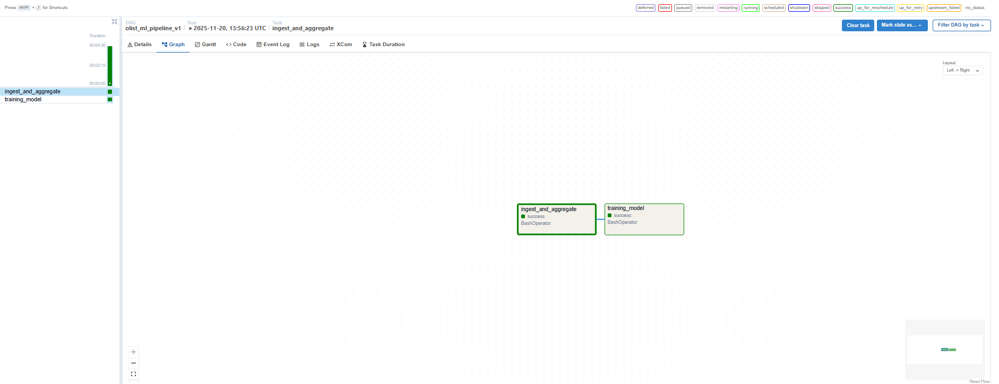
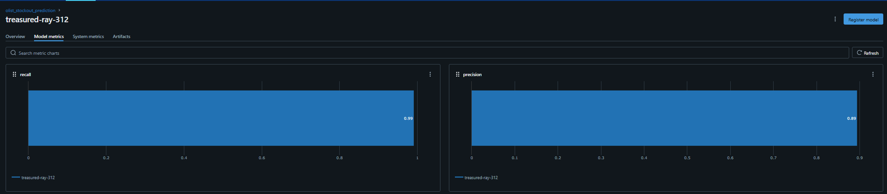
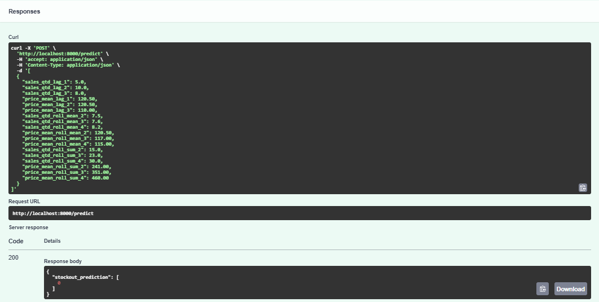

# 📦 MLOps: Previsão de Ruptura de Estoque (Olist)


## 🎯 O Problema de Negócio
Imagine ser um grande vendedor em um marketplace e descobrir que seu produto "campeão de vendas" acabou bem na semana da Black Friday. O resultado? **Perda de receita** e clientes frustrados indo para a concorrência.

O objetivo deste projeto não é apenas criar um modelo preditivo, mas construir um **Sistema de Alerta Antecipado**. O sistema analisa o comportamento histórico de vendas e prevê a probabilidade de **Ruptura de Estoque (Stockout)** para a próxima semana, permitindo que o time de logística reponha o produto a tempo.

---

## 🏗️ A Arquitetura da Solução

O projeto foi desenvolvido seguindo as melhores práticas de **MLOps** (Machine Learning Operations), garantindo reprodutibilidade, rastreabilidade e escalabilidade.

### O Pipeline
1.  **Ingestão & Feature Store:** Transformação de dados transacionais brutos (pedidos) em uma série temporal semanal por produto.
2.  **Feature Engineering:** Criação de janelas temporais (Lags, Médias Móveis) com tratamento rigoroso contra *Data Leakage* (vazamento de dados futuros).
3.  **Continuous Training (CT):** Pipeline automatizado no **Airflow** que re-treina o modelo periodicamente.
4.  **Experiment Tracking:** Uso do **MLflow** para logar métricas, parâmetros e versionar os artefatos do modelo.
5.  **Model Serving:** Uma API REST em **FastAPI** que consome o modelo diretamente do MLflow e serve predições em tempo real.

---

## 🛠️ Tech Stack

| Componente | Tecnologia | Função no Projeto |
| :--- | :--- | :--- |
| **Linguagem** | Python 3.11 | Pandas, Scikit-Learn, Numpy. |
| **Infraestrutura** | Docker & Docker Compose | Isolamento de ambiente e orquestração de containers. |
| **Orquestração** | Apache Airflow | Gerenciamento do pipeline de dados e retreino. |
| **Model Store** | MLflow | Rastreamento de experimentos e registro de modelos. |
| **Serving** | FastAPI | API de alta performance para disponibilizar o modelo. |
| **Banco de Dados** | PostgreSQL | Backend store para Airflow e MLflow. |

---

## Como Rodar Localmente

Este projeto é totalmente "containerizado". Você só precisa do Docker instalado.

### 1. Clone o Repositório
```bash
git clone https://github.com/rodrigo-sr/olist-mlops.git
cd olist-mlops
```
### 2. Suba o Ambiente
```bash
docker compose up -d --build
```
Isso irá baixar as imagens, instalar as dependências e iniciar os serviços: Airflow, MLflow, Postgres e API.

### 3. Acesse os Serviços
* Airflow (Pipeline): http://localhost:8080 (Login: admin / admin)

* MLflow (Experimentos): http://localhost:5000

* API Documentation (Swagger): http://localhost:8000/docs

---

## 📊 Detalhes de Modelagem

### Engenharia de Features
Foram dados públicos do E-commerce Brasileiro (Olist).

* **Tratamento de "Buracos" no Tempo**: Produtos que não venderam em uma semana não apareciam no banco. Foi feito um processo de densificação (Cross Join) para preencher essas lacunas com Zero, garantindo que o modelo aprenda o que é "não vender".

* **Features Temporais**: *type*_lag_x (venda semana anterior), *type*_roll_primitive_window (média móvel 4 semanas).
    * Onde:
        * $\mathbf{x}$: lag da semana, ex.: $x=1$ será referente a semana anterior;
        * **primitive**: será a estatística a ser calculada, ex.: sum, mean.
        * **window**: janela da informação, ex.: window = 4, será referente a informação das 4 semanas anteriores.

* **Prevenção de Leakage**: Todas as médias móveis foram deslocadas (shift) para garantir que o modelo não tenha acesso a dados da semana atual durante o treino.

### O Modelo
* **Algoritmo**: RandomForestClassifier (Baseline).

* **Métrica Alvo**: Recall (Foi priorizado encontrar todas as rupturas possíveis, mesmo que isso gere alguns alarmes falsos, pois o custo da ruptura é maior que o custo do estoque extra).

* **OBS**: na versão atual ainda não foi desenvolvida a seleção de features ou modelos para verificar o melhor desempenho assim como obter o melhor modelo sem *overffiting*.

---

## 📡API de Predição
A API recebe o histórico recente de um produto e retorna 1 (Risco de Ruptura) ou 0 (Estoque Saudável).

### Exemplo de Request (JSON):

```JSON

POST /predict
[
  {
    "sales_qtd_lag_1": 5.0,
    "sales_qtd_lag_2": 10.0,
    "sales_qtd_roll_mean_4": 8.2,
    ...
  }
]
```

### Resposta:

```JSON

{
  "stockout_prediction": [ 1 ]
}
```

---

## 📐 Arquitetura do Projeto

O diagrama abaixo ilustra o fluxo de dados e a interação entre os containers Docker:

```mermaid
graph LR
    %% --- DEFINIÇÃO DE ESTILOS ---
    classDef docker fill:#e1f5fe,stroke:#01579b,stroke-width:2px,color:#01579b,stroke-dasharray: 5 5;
    classDef raw fill:#ffecb3,stroke:#ff6f00,stroke-width:2px,color:black;
    classDef process fill:#c8e6c9,stroke:#2e7d32,stroke-width:2px,color:black;
    classDef train fill:#c8e6c9,stroke:#2e7d32,stroke-width:2px,color:black;
    classDef registry fill:#b3e5fc,stroke:#0277bd,stroke-width:2px,color:black;
    classDef persist fill:#d1c4e9,stroke:#512da8,stroke-width:2px,color:black;
    classDef serving fill:#ffccbc,stroke:#bf360c,stroke-width:2px,color:black;
    classDef user fill:#f5f5f5,stroke:#333,stroke-width:2px,color:black;

    %% --- AMBIENTE DOCKER (CAIXA MAIOR) ---
    subgraph Docker_Environment [🐳 Ambiente Docker Compose]
        direction LR

        %% COLUNA 1: ENTRADA
        subgraph Col1 [1. Entrada]
            direction TB
            RawData[("📂 CSVs<br/>(Dados Brutos)")]:::raw
        end

        %% COLUNA 2: PROCESSAMENTO
        subgraph Col2 [2. Processamento]
            direction TB
            AirflowIngest["⚙️ Airflow Task<br/>(Ingest & Features)"]:::process
        end

        %% COLUNA 3: TREINAMENTO
        subgraph Col3 [3. Treinamento]
            direction TB
            AirflowTrain["🧠 Airflow Task<br/>(Train & Evaluate)"]:::train
        end

        %% COLUNA 4: REGISTRO
        subgraph Col4 [4. Registro]
            direction TB
            MLflow["🧪 MLflow Server<br/>(Gestão de Ciclo de Vida)"]:::registry
        end

        %% COLUNA 5: PERSISTÊNCIA
        subgraph Col5 [5. Persistência]
            direction TB
            Postgres[("🐘 PostgreSQL<br/>(Metadados)")]:::persist
            Artifacts[("📦 Volumes<br/>(Modelos .pkl)")]:::persist
        end

        %% COLUNA 6: SERVING
        subgraph Col6 [6. Serving]
            direction TB
            FastAPI["⚡ FastAPI<br/>(Endpoint /predict)"]:::serving
        end
    end

    %% --- USUÁRIO (FORA DO DOCKER) ---
    subgraph Col7 [7. Consumidor]
        User([👤 Usuário]):::user
    end

    %% --- CONEXÕES DO FLUXO ---
    
    %% Fluxo de ETL
    RawData --> AirflowIngest
    AirflowIngest -->|"Gera Parquet"| AirflowTrain
    
    %% Fluxo de MLOps
    AirflowTrain -->|"Loga Métricas"| MLflow
    AirflowTrain -.->|"Salva Artefato"| Artifacts
    
    %% Fluxo de Dependência
    MLflow -.->|"Grava IDs"| Postgres
    
    %% Fluxo de Serving
    Artifacts -.->|"Carrega Modelo"| FastAPI
    MLflow -.->|"Valida Versão"| FastAPI
    
    %% Fluxo do Usuário
    User -->|"POST JSON"| FastAPI
    FastAPI -->|"Retorna Score"| User

    %% Links Clicáveis
    click FastAPI "http://localhost:8000/docs" "Ver Swagger"
    click MLflow "http://localhost:5000" "Ver MLflow"
```


---

## Próximos Passos
* [ ] Implementar monitoramento de Data Drift com Evidently AI.

* [ ] Testar modelos mais robustos (XGBoost/LightGBM).

* [ ] Criar um Dashboard no Streamlit para visualização dos alertas.

## Imagens exemplo

* Airflow DAG


* Experimento MLflow


* API
